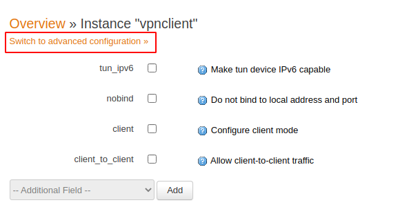
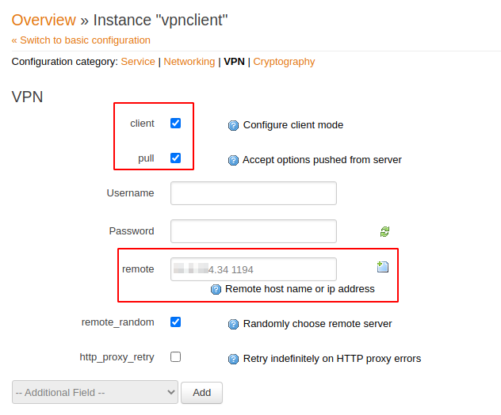

## Generate Public Key Infrastructure with EasyRSA:
Help: https://community.openvpn.net/openvpn/wiki/EasyRSA3-OpenVPN-Howto

1. Get the `easy-rsa` tool

    ```bash
    cd
    git clone https://github.com/OpenVPN/easy-rsa.git
    cd easy-rsa/easyrsa3/
    cp vars.example vars
    ```

1. Edit `vars` file, especially set

    `EASYRSA_DN "org"`

    And assign values to:
    * `EASYRSA_REQ_COUNTRY`
    * `EASYRSA_REQ_PROVINCE`
    * `EASYRSA_REQ_CITY`
    * `EASYRSA_REQ_ORG`
    * `EASYRSA_REQ_EMAIL`

    ---
    **NOTE**

    DON'T LEAVE ANY OF THE FIELDS EMPTY!!!

    ---

1. Init PKI

    ```bash
    ./easyrsa init-pki
    ```

1. Generate Diffie-Hellman parameters

    ```bash
    ./easyrsa gen-dh
    ```

1. Create CA (Certificate Authority)

    ```bash
    ./easyrsa build-ca
    ```
    You have to set some password. That password will be required on the next steps.

1. Build certificate and key for server

    ```bash
    ./easyrsa build-server-full <SERVER_NAME> nopass
    ```

1. Build certificate for client

    ```bash
    ./easyrsa build-client-full <CLIENT_NAME> nopass
    ```

1. After all, you should get a files structure like

    


## Setup OpenVPN server

1. Login to router and go to Services -> VPN -> OpenVPN

    

    

1. Create a new `OpenVPN` instance, choose a name and select `Server configuration for a routed multi-client VPN`

    

1. After creating, switch to advanced configuration

    

1. On the `Networking` tab add

    * `dev` and set to `tun0`

    

1. On the `Cryptography`

    * select `tls_server`
    * add `ca` and upload proper file
    * add `dh` and upload proper file
    * add `cert` and upload proper file
    * add `key` and upload proper file
    (see `PKI files structure` above)

    

1. Go back to `Overview` and enable the server

    

    Enable server (1), `Save & Apply` (2) and `Start` the server (3).

    

1. If everything went fine, you should get the server `Started` and `Uptime` timer should count the time

    

1. Open `UDP` port `1194` on the firewall

    Go to `Firewall`

    

    Go to `Traffic Rules`

    

    In the `Open ports on router` section, enter port number `1194`, protocol `UDP` and choose a name (or left default) and click `Add`:

    

    Then select `Save & Apply` on the bottom.

## Setup OpenVPN client

1. Login to router and go to Services -> VPN -> OpenVPN

    

    

1. Create a new `OpenVPN` instance, choose a name and select `Client configuration for a routed multi-client VPN` and click `Add`

    

1. After creating, switch to advanced configuration:

    

1. On the `Networking` tab add

    * `dev` and set to `tun0`

    

1. On the `VPN` tab

    * enable `client`
    * enable `pull` (will be visible after enabling `client`)
    * add `remote` and enter `VPN Server` IP address and port `1194`

    

1. On the `Cryptography` tab

    * add `ca` and upload proper file
    * add `dh` and upload proper file
    * add `cert` and upload proper file
    * add `key` and upload proper file
    (see `PKI files structure` above)

    

1. Click `Save` and go back to `Overview`, then `Enable` and `Start` service.

    

## Troubleshooting

If something is not working (whether on `server` or `client`) you can add to VPN instance `verb` paramter with value `11`. After stopping and starting server in `Status -> System Log` you shoulkd get more detailed inofrmation about the problem with OpenVPN instance.